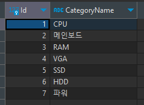
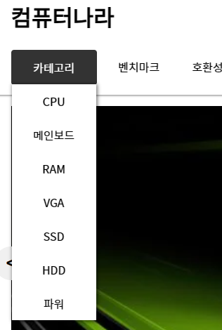

## 📝과제 - SFlask&Pymysql을 이용하여 본인의 DB를 연동해 내가 만든 HTML에 데이터를 넘겨보기

> SQL의 CRUD와 Python의 Flask&Pymysql을 이용하여 본인의 DB를 연동하고 데이터를 SELECT 또는 INSERT 할 수 있는 구문과 코드를 작성하여 내가 만들어놓은 html 문서에 데이터를 넘겨보는 작업을 완료하기.

### 폴더 구조

css, images, js 파일들을 넣어두는 static 폴더, html파일을 넣어두는 templates 폴더, 그리고 app을 실행시키는 app.py로 구조를 만들었다.

📦0803  
 ┣ 📂static  
 ┃ ┣ 📂css  
 ┃ ┃ ┗ 📜style.css  
 ┃ ┣ 📂images  
 ┃ ┃ ┣ 📜12900k.webp  
 ┃ ┃ ┣ 📜13900k.webp  
 ┃ ┃ ┣ 📜7700x.webp  
 ┃ ┃ ┣ 📜7900x.webp  
 ┃ ┃ ┣ 📜rtx4070.webp  
 ┃ ┃ ┣ 📜rtx4080.webp  
 ┃ ┃ ┣ 📜rx7900.webp  
 ┃ ┃ ┣ 📜slide_image1.webp  
 ┃ ┃ ┣ 📜slide_image2.webp  
 ┃ ┃ ┗ 📜slide_image3.webp  
 ┃ ┗ 📂js  
 ┃ ┃ ┗ 📜index.js  
 ┣ 📂templates  
 ┃ ┗ 📜index.html  
 ┗ 📜app.py

### DB

category 테이블에 Id와 CategoryName 필드를 만들고 카테고리에 필요한 값들을 추가하였다.



### app.py

강사님이 만들어 주신 flask.py에서 내 데이터베이스를 연동하고 내가 만든 HTML을 렌더링 하도록 수정하였다. DB에서 category 이름들을 가져와 category변수에 넣어 index.html로 넘겨주었다.

```python
from flask import Flask, render_template
import pymysql

app = Flask(__name__)


@app.route("/")
def index():
    db_conn = pymysql.connect(
        host="localhost",
        user="root",
        password="1234",
        database="컴퓨터나라",
        autocommit=True,
        cursorclass=pymysql.cursors.DictCursor,
    )
    with db_conn:
        db_cursor = db_conn.cursor()
        db_cursor.execute("SELECT * FROM category")
        category = db_cursor.fetchall()

    return render_template("index.html", category=category)


if __name__ == "__main__":
    app.run(debug=True)

```

### HTML

DB에서 가져온 category 이름들을 받아와 cateogry_list 클래스명을 가진 ul태그에 for문을 통해 카테고리 이름들을 출력하도록 했다.

```django
<li class="nav_item category">
  카테고리
  <ul class="category_list">
    
    <li class="category_item">{{item["CategoryName"]}}</li>
    
  </ul>
</li>
```

### 카테고리 결과


