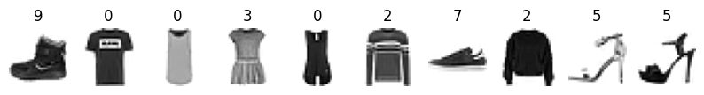

## 📝과제 - 패션 인공지능 실습

```python
from tensorflow import keras
import matplotlib.pyplot as plt
import numpy as np
```

### 패션 MNIST 데이터 셋 불러오기

```python
(train_input, train_target), (test_input, test_target) = keras.datasets.fashion_mnist.load_data()
```

#### 데이터셋 살펴보기

각 어레이의 shape와 matplotlib을 이용해 이미지를 출력하기

0부터 9까지의 값은 옷의 클래스를 나타내는 레이블이다.

|레이블|설명|
|---|---|
|0|T-shirt/top|
|1|Trouser|
|2|Pullover|
|3|Dress|
|4|Coat|
|5|Sandal|
|6|Shirt|
|7|Sneaker|
|8|Bag|
|9|Ankle boot|

```python
print((train_input.shape, train_target.shape))
print((test_input.shape, test_target.shape))

#((60000, 28, 28), (60000,))
#((10000, 28, 28), (10000,))
```

```python
fig, axs = plt.subplots(1, 10, figsize=(10, 10))
for i in range(10):
  axs[i].imshow(train_input[i], cmap="gray_r")
  axs[i].axis("off")
  axs[i].set_title(train_target[i])
plt.show()
```



### 패션 MNIST 데이터 전처리

데이터 크기를 정규화한다. 0에서 255사이의 값을 갖는 데이터들을 0부터 1사이의 값을 갖도록 변환한다.

```python
train_scaled = train_input / 255.0
train_scaled = train_scaled.reshape(-1, 28*28)
print(train_scaled.shape)
#(60000, 784)
```

#### 데이터 셋 나누기

학습데이터와 평가데이터 셋으로 나눈다.

``` python
from sklearn.model_selection import train_test_split

train_scaled, val_scaled, train_target, val_target = train_test_split(train_scaled, train_target, test_size=0.2, random_state=42)
print(train_scaled.shape, train_target.shape)
print(val_scaled.shape, val_target.shape)

#(48000, 784) (48000,)
#(12000, 784) (12000,)
```

### 모델 구성

```python
model = keras.Sequential(
    keras.layers.Dense(10, activation="softmax", input_shape=(784, ))
)

model.summary()

"""
Model: "sequential_2"
_________________________________________________________________
 Layer (type)                Output Shape              Param #   
=================================================================
 dense_1 (Dense)             (None, 10)                7850      
                                                                 
=================================================================
Total params: 7,850
Trainable params: 7,850
Non-trainable params: 0
_________________________________________________________________
"""
```

```python
model.compile(loss='sparse_categorical_crossentropy', metrics='accuracy')
```

### 모델 학습하기

```python
model.fit(train_scaled, train_target, epochs=5)
```

### 모델 정확도 평가

```python
model.evaluate(val_scaled, val_target)

# [0.45658114552497864, 0.8454999923706055]
```

